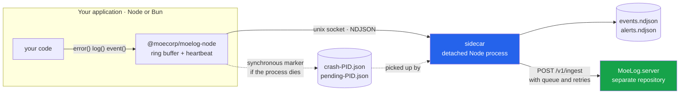

# MoeLog.js

The JavaScript/TypeScript SDK for **MoeLog**: logs, errors and process health, at almost no cost
inside your application.

> **Status: alpha (0.0.2-alpha.1).** The protocol may change. This repository holds the
> JavaScript SDK only; the ingest API and dashboard live in
> [MoeLog.server](https://github.com/Moe-Corp/MoeLog.server).

---

## The idea in one sentence

Your application does no networking: it writes to a local socket and forgets. A **separate
process** — the sidecar — persists, retries and uploads to `MoeLog.server`. Because it lives
outside your process, it is the only thing that can tell you how you died.



## Packages

| Package | What it is | gzip | Dependencies |
|---|---|---|---|
| `@moecorp/moelog-core` | Microkernel: ring buffer, scope, hooks, dedup, MLWP | 4.0 kB | — |
| `@moecorp/moelog-sidecar` | The sidecar channel: protocol, transport, daemon, CLI | 3.9 kB + 4.5 kB (daemon) | core |
| **`@moecorp/moelog-node`** | **SDK for Node** | **0.95 kB** | core, sidecar |
| **`@moecorp/moelog-bun`** | **SDK for Bun** | **1.3 kB** | core, sidecar |

Zero third-party dependencies across the whole chain. The runtime packages are deliberately thin:
everything that does not depend on the runtime lives in `sidecar`, and **there is one single
sidecar** — no Node version and Bun version of the process that watches you.

### Why Node and Bun are separate packages

Not cosmetics. They behave differently at exactly the most delicate point, and a single package
would have to lie to one of them:

| | Node | Bun |
|---|---|---|
| Unhandled promise rejection | Becomes an uncaught exception, **kills the process**, `uncaughtExceptionMonitor` sees it with a stack | Is printed, **the process stays alive** with exit code 0, the monitor never hears about it |
| What MoeLog does by default | **Nothing.** Registering a listener would only break native behaviour | **Registers the listener.** It is the only way to see it, and Bun was not going to die anyway |
| Resulting signal | `app.fatal` | error event, no alert |
| Sidecar binary | the same `process.execPath` | looks for a real `node` on PATH, falls back to Bun |

That difference is verified by the repository's two e2e suites: the same scenario yields
`app.fatal` on Node and an alert-free event on Bun, and each suite asserts what its runtime
actually does.

## What it detects

| Situation | How it is detected | Signal |
|---|---|---|
| Error captured by hand | `error(e)` | level 50 event |
| Uncaught exception | `uncaughtExceptionMonitor` + synchronous disk marker | `app.fatal` |
| Unhandled promise rejection | runtime dependent (table above) | `app.fatal` or an event |
| **Blocked event loop** | the sidecar stops receiving the heartbeat | `app.blocked` / `app.recovered` |
| **Abrupt death** (SIGKILL, OOM, panic) | the socket dropped and there is no exit marker | `app.crashed` |
| Non-zero exit code | exit marker | `app.exited_error` |
| **The app never starts** | `moelog run -- <cmd>` supervises it from outside | `app.failed_to_start` |

The three in bold are the ones no in-process SDK can report on its own: warning about a blocked
event loop would need the very event loop that is blocked, warning about a SIGKILL would need to
be alive, and warning that the app never started would need it to have started.

---

## Installation (local, not published yet)

```bash
bun install          # installs the whole workspace
bun run build        # produces packages/*/dist
```

In your project, one **or** the other depending on your runtime:

```json
{ "dependencies": { "@moecorp/moelog-node": "file:../path/to/MoeLog.js/packages/node" } }
{ "dependencies": { "@moecorp/moelog-bun":  "file:../path/to/MoeLog.js/packages/bun"  } }
```

Do not install both. Each one declares the `moelog` binary, and both pull the same sidecar.

## Usage

Identical for both; only the import changes.

```ts
import { init, log, error, event } from '@moecorp/moelog-node'   // or '@moecorp/moelog-bun'

init({
  app: 'my-api',
  release: '1.4.2',
  env: 'production',
})

log('info', 'server up', { port: 3000 })
event('checkout.completed', { amount: 4200 })

try {
  await charge()
} catch (e) {
  error(e, { route: '/checkout' })
}
```

The sidecar starts itself the first time and the files show up in `./.moelog/`.

### Common options

| Option | Default | What it does |
|---|---|---|
| `app` | `'app'` | Name it appears under in the records |
| `release` / `env` | `'0.0.0'` / `'development'` | Batch context |
| `dataDir` | `./.moelog` | Where the sidecar and its files live |
| `autostart` | `true` | Launch the sidecar if none is running |
| `server` | — | MoeLog server URL. **Your app never talks to that URL**: it hands it to the sidecar |
| `key` | — | Ingest key (or `MOELOG_KEY`) |
| `captureGlobals` | `true` | Install the unhandled-error handlers |
| `hbMs` | `2000` | Heartbeat period; a block is declared after 3 missed beats |
| `handleSignals` | `true` | Report before dying on SIGINT/SIGTERM, then re-raise the signal |
| `sampleRate` / `errorSampleRate` | `1` / `1` | Sampling (0..1) |
| `maxBuffer` / `flushAt` | `64` / `32` | Ring buffer and size trigger |
| `flushIntervalMs` | `5000` | Time trigger |
| `flushOnLevel` | `50` (error) | Severity that forces an immediate send |
| `dedupeWindowMs` | `2000` | Fingerprint deduplication window |
| `beforeSend` | — | Last chance to modify or drop an event |
| `debug` | `false` | SDK internal warnings on the console |

### Per-runtime option

```ts
// @moecorp/moelog-node
init({ unhandledRejections: 'native' })   // default: Node's semantics are untouched
init({ unhandledRejections: 'observe' })  // captures, but DISABLES the process death

// @moecorp/moelog-bun
init({ unhandledRejections: 'capture' })  // default: the only way to see them on Bun
init({ unhandledRejections: 'off' })      // blind to rejections
```

### Sending to a server

```ts
init({
  app: 'my-api',
  server: 'http://localhost:3000',   // or MOELOG_SERVER
  key: 'mlk_pub_dev',                // or MOELOG_KEY
})
```

Your app **does not talk to that URL**. It hands it to the sidecar at launch and forgets. The
queue, the exponential backoff and the server being down all happen in another process. Measured
with the server switched off: emitting five errors cost the app **0.62 ms**, and all five arrived
on their own when the server came back.

Without `server` the sidecar works the same and keeps the local NDJSON. The NDJSON is written
either way: it is not a degraded mode, it is the local record and the backup.

> If a sidecar is already alive with a different configuration, these values will not reach it.
> Run `moelog stop` and start again to re-point it.

---

## The server

The ingest API and the dashboard live in their own repository:
[**MoeLog.server**](https://github.com/Moe-Corp/MoeLog.server). Setting it up is a `git clone` and
a `bun run dev`; its README covers the rest.

This SDK does not depend on it. Without a `server` option the sidecar keeps writing the local
NDJSON, and everything in this repository — including both e2e suites — works with no server at
all.

To exercise the two together, run the server and point a sandbox at it:

```bash
cd sandbox/bun-app
MOELOG_SERVER=http://localhost:3000 MOELOG_KEY=mlk_pub_dev bun run e2e
```

Open the dashboard while it runs: errors show up on their own, no reload.

---

## CLI

```bash
moelog run -- bun run index.ts   # supervise: the only way to see "it never started"
moelog status                    # sidecar status and upstream queue
moelog tail -n 20                # latest events, readable
moelog alerts -n 20              # crashes, blocks, failed startups
moelog daemon                    # sidecar in the foreground (debugging)
moelog stop                      # shut it down
```

Environment variables: `MOELOG_DATA`, `MOELOG_SOCK`, `MOELOG_WEBHOOK` (POSTs every alert),
`MOELOG_NODE` (binary used to launch the sidecar; wins over any detection).

---

## Architecture

**Microkernel plus integrations, not CQRS/VSA.** CQRS needs two sides and an SDK only has one:
it writes. And a mediator resolving handlers through a registry makes every handler reachable, so
the bundler can drop nothing — which is the opposite of what a byte budget needs. Integrations are
composed explicitly in `init()`, so the bundler sees the graph.

**No runtime validation library.** `zod` is around 13 kB gzipped, four times the entire budget of
a browser SDK, and even the trimmed alternatives eat the whole core. Instead: dev-only assertions
that a production build strips through dead-code elimination, and optional
[Standard Schema](https://standardschema.dev) support so you can plug in the validator your
project already has, at zero bytes for everyone who does not.

**The sidecar.** In Node and Bun the SDK does no networking, because a separate process is the
only thing that can report a SIGKILL or a blocked event loop. The price is one extra process; it
starts itself, shuts itself down after 120 s with no clients, and retires if its data directory
disappears.

```
packages/core/src/       buffer · scheduler · hooks · serialize · fingerprint · stack
packages/sidecar/src/    protocol · paths · markers · transport · health
  daemon/                sinks · watchdog · post-mortem classification · launch
  cli/                   run · status · tail · alerts · stop
  sdk.ts                 defineSdk(): the factory the runtimes are built on
packages/node/src/       what Node does differently (~100 lines)
packages/bun/src/        what Bun does differently (~120 lines)
sandbox/bun-app/         test server + e2e of the 7 scenarios
sandbox/node-app/        e2e of the 7 scenarios under Node
```

## Development

```bash
bun run build              # builds the four packages
bun run typecheck          # tsc --noEmit
bun run publicar:ensayo    # dry run: shows exactly what would be published

cd sandbox/bun-app  && bun run e2e     # 7/7 under Bun
cd sandbox/node-app && npm run e2e     # 7/7 under Node
```

## Related repositories

| Repository | What it holds |
|---|---|
| **MoeLog.js** (this one) | The JavaScript/TypeScript SDK: `core`, `sidecar`, `node`, `bun` |
| [MoeLog.server](https://github.com/Moe-Corp/MoeLog.server) | Ingest API and dashboard |
| MoeLog.spec | The MLWP wire protocol and its conformance suite — extracted once v1 is frozen |
| MoeLog.py · .go · .rs · .java | SDK ports, once MLWP v1 is stable |

## License

[AGPL-3.0-only](LICENSE).

Note that the SDKs are **imported into the user's application**, so the AGPL's copyleft reaches
further here than it would for a server-only project.

Splitting the licensing is still an open decision: permissive (Apache-2.0) for the SDKs, with the
AGPL kept for the server — which is the pattern Sentry and Grafana both follow, and for the same
reason. If the current licensing blocks your use case, open an issue.
